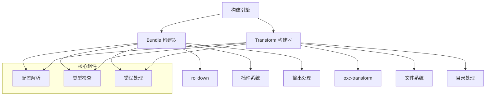

# 构建器

robuild 的构建器是核心组件，负责实际的构建工作。本文档详细介绍 Bundle 和 Transform 两种构建器的实现。

## 构建器架构

### 整体设计



## Bundle 构建器

### 核心功能

Bundle 构建器负责将多个文件打包成单个文件，主要用于库发布和应用程序构建。

### 实现原理

```typescript
// src/builders/bundle.ts
export class BundleBuilder {
  private rolldown: Rolldown
  private plugins: Plugin[]

  constructor(options: BundleOptions) {
    this.rolldown = new Rolldown(options)
    this.plugins = options.plugins || []
  }

  async build(entry: BundleEntry): Promise<BuildResult> {
    // 1. 解析入口文件
    const inputs = this.resolveInputs(entry.input)

    // 2. 配置 rolldown
    const config = this.createRolldownConfig(entry)

    // 3. 执行构建
    const result = await this.rolldown.build(config)

    // 4. 后处理
    return this.postProcess(result, entry)
  }
}
```

### 构建流程

#### 1. 入口解析

```typescript
private resolveInputs(input: string | string[]): string[] {
  if (Array.isArray(input)) {
    return input.map(this.resolvePath)
  }
  return [this.resolvePath(input)]
}

private resolvePath(path: string): string {
  return resolve(this.cwd, path)
}
```

#### 2. 配置生成

```typescript
private createRolldownConfig(entry: BundleEntry): RolldownConfig {
  return {
    input: this.resolveInputs(entry.input),
    output: {
      dir: entry.outDir || 'dist',
      format: entry.rolldown?.output?.format || 'esm',
      name: entry.rolldown?.output?.name,
      manualChunks: entry.rolldown?.output?.manualChunks
    },
    external: entry.rolldown?.external || [],
    plugins: this.plugins,
    platform: entry.rolldown?.platform || 'neutral',
    target: entry.rolldown?.target || 'ES2020'
  }
}
```

#### 3. 构建执行

```typescript
private async executeBuild(config: RolldownConfig): Promise<RolldownResult> {
  try {
    // 设置插件
    for (const plugin of this.plugins) {
      await plugin.setup?.(this.context)
    }

    // 执行构建
    const result = await this.rolldown.build(config)

    return result
  } catch (error) {
    throw new BuildError(`Bundle 构建失败: ${error.message}`, error)
  }
}
```

#### 4. 后处理

```typescript
private async postProcess(result: RolldownResult, entry: BundleEntry): Promise<BuildResult> {
  const outputFiles: string[] = []

  // 处理输出文件
  for (const chunk of result.output) {
    const outputPath = join(entry.outDir || 'dist', chunk.fileName)

    // 写入文件
    await writeFile(outputPath, chunk.code, 'utf-8')
    outputFiles.push(outputPath)

    // 生成源码映射
    if (entry.sourcemap && chunk.map) {
      const mapPath = outputPath + '.map'
      await writeFile(mapPath, JSON.stringify(chunk.map), 'utf-8')
      outputFiles.push(mapPath)
    }
  }

  // 生成 TypeScript 声明文件
  if (entry.dts) {
    const dtsFiles = await this.generateDts(entry)
    outputFiles.push(...dtsFiles)
  }

  return {
    outputFiles,
    duration: Date.now() - this.startTime,
    errors: []
  }
}
```

### 插件系统

Bundle 构建器支持 rolldown 插件：

```typescript
interface BundlePlugin {
  name: string
  setup?: (build: BuildContext) => void | Promise<void>
  transform?: (code: string, id: string) => string | Promise<string>
  load?: (id: string) => string | Promise<string>
  generateBundle?: (options: GenerateBundleOptions) => void | Promise<void>
}
```

### 内置插件

#### 1. Shebang 插件

```typescript
export function shebangPlugin(options: ShebangOptions = {}): BundlePlugin {
  return {
    name: 'shebang',
    setup(build) {
      build.onLoad({ filter: /\.(js|mjs)$/ }, async (args) => {
        const code = await readFile(args.path, 'utf-8')

        if (code.startsWith('#!')) {
          return {
            contents: code,
            loader: 'js'
          }
        }

        return null
      })
    }
  }
}
```

#### 2. JSON 插件

```typescript
export function jsonPlugin(): BundlePlugin {
  return {
    name: 'json',
    setup(build) {
      build.onLoad({ filter: /\.json$/ }, async (args) => {
        const contents = await readFile(args.path, 'utf-8')
        const data = JSON.parse(contents)

        return {
          contents: `export default ${JSON.stringify(data)}`,
          loader: 'js'
        }
      })
    }
  }
}
```

## Transform 构建器

### 核心功能

Transform 构建器负责转换目录中的所有文件，保持文件结构，主要用于运行时文件处理。

### 实现原理

```typescript
// src/builders/transform.ts
export class TransformBuilder {
  private oxc: OxcTransform
  private fileSystem: FileSystem

  constructor(options: TransformOptions) {
    this.oxc = new OxcTransform(options)
    this.fileSystem = new FileSystem(options.cwd)
  }

  async build(entry: TransformEntry): Promise<BuildResult> {
    // 1. 扫描文件
    const files = await this.scanFiles(entry.input)

    // 2. 并行转换
    const results = await Promise.all(
      files.map(file => this.transformFile(file, entry))
    )

    // 3. 写入输出
    await this.writeOutput(results, entry.outDir)

    return {
      outputFiles: results.map(r => r.outputPath),
      duration: Date.now() - this.startTime,
      errors: results.flatMap(r => r.errors)
    }
  }
}
```

### 构建流程

#### 1. 文件扫描

```typescript
private async scanFiles(inputDir: string): Promise<string[]> {
  const files: string[] = []

  async function scan(dir: string) {
    const entries = await readdir(dir, { withFileTypes: true })

    for (const entry of entries) {
      const fullPath = join(dir, entry.name)

      if (entry.isDirectory()) {
        await scan(fullPath)
      } else if (this.isTargetFile(entry.name)) {
        files.push(fullPath)
      }
    }
  }

  await scan(inputDir)
  return files
}

private isTargetFile(filename: string): boolean {
  const extensions = ['.ts', '.js', '.mjs', '.json']
  return extensions.some(ext => filename.endsWith(ext))
}
```

#### 2. 文件转换

```typescript
private async transformFile(filePath: string, entry: TransformEntry): Promise<TransformResult> {
  try {
    // 读取源文件
    const sourceCode = await readFile(filePath, 'utf-8')

    // 确定输出路径
    const relativePath = relative(entry.input, filePath)
    const outputPath = join(entry.outDir, relativePath)

    // 转换代码
    const transformedCode = await this.oxc.transform(sourceCode, {
      filename: filePath,
      target: entry.oxc?.typescript?.target || 'ES2020',
      module: entry.oxc?.typescript?.module || 'ESNext'
    })

    // 压缩（如果启用）
    let finalCode = transformedCode
    if (entry.minify) {
      finalCode = await this.minify(finalCode, entry.minify)
    }

    return {
      outputPath,
      code: finalCode,
      errors: []
    }
  } catch (error) {
    return {
      outputPath: '',
      code: '',
      errors: [error]
    }
  }
}
```

#### 3. 输出写入

```typescript
private async writeOutput(results: TransformResult[], outDir: string): Promise<void> {
  for (const result of results) {
    if (result.errors.length > 0) continue

    // 确保输出目录存在
    const outputDir = dirname(result.outputPath)
    await mkdir(outputDir, { recursive: true })

    // 写入文件
    await writeFile(result.outputPath, result.code, 'utf-8')

    // 生成源码映射
    if (this.options.sourcemap) {
      const mapPath = result.outputPath + '.map'
      const sourcemap = await this.generateSourcemap(result)
      await writeFile(mapPath, JSON.stringify(sourcemap), 'utf-8')
    }
  }
}
```

### 文件系统处理

#### 1. 目录结构保持

```typescript
private maintainDirectoryStructure(inputDir: string, outDir: string): void {
  // 保持输入目录的结构
  const relativePath = relative(this.cwd, inputDir)
  const outputPath = join(outDir, relativePath)

  // 创建输出目录
  mkdirSync(outputPath, { recursive: true })
}
```

#### 2. 文件过滤

```typescript
private shouldProcessFile(filePath: string): boolean {
  // 排除测试文件
  if (filePath.includes('.test.') || filePath.includes('.spec.')) {
    return false
  }

  // 排除类型文件
  if (filePath.endsWith('.d.ts')) {
    return false
  }

  // 检查文件扩展名
  const extensions = ['.ts', '.js', '.mjs', '.json']
  return extensions.some(ext => filePath.endsWith(ext))
}
```

## 构建器配置

### Bundle 配置

```typescript
interface BundleBuilderConfig {
  cwd: string
  plugins?: BundlePlugin[]
  rolldown?: RolldownOptions
  minify?: MinifyOptions
  sourcemap?: SourcemapOptions
  dts?: DtsOptions
}
```

### Transform 配置

```typescript
interface TransformBuilderConfig {
  cwd: string
  oxc?: OxcOptions
  resolve?: ResolveOptions
  minify?: MinifyOptions
  sourcemap?: SourcemapOptions
}
```

## 性能优化

### 1. 并行处理

```typescript
// Transform 构建器中的并行文件处理
const results = await Promise.all(
  files.map(file => this.transformFile(file, entry))
)
```

### 2. 缓存机制

```typescript
private cache = new Map<string, TransformResult>()

private async getCachedResult(filePath: string): Promise<TransformResult | null> {
  const stat = await stat(filePath)
  const cacheKey = `${filePath}:${stat.mtime.getTime()}`

  return this.cache.get(cacheKey) || null
}
```

### 3. 增量构建

```typescript
private async shouldRebuild(filePath: string): Promise<boolean> {
  const outputPath = this.getOutputPath(filePath)

  try {
    const inputStat = await stat(filePath)
    const outputStat = await stat(outputPath)

    return inputStat.mtime > outputStat.mtime
  } catch {
    return true // 输出文件不存在，需要构建
  }
}
```

## 错误处理

### 1. 构建错误

```typescript
export class BuildError extends Error {
  constructor(
    message: string,
    public originalError?: Error,
    public filePath?: string
  ) {
    super(message)
    this.name = 'BuildError'
  }
}
```

### 2. 文件错误

```typescript
export class FileError extends Error {
  constructor(
    message: string,
    public filePath: string,
    public operation: string
  ) {
    super(`${operation} 失败 (${filePath}): ${message}`)
    this.name = 'FileError'
  }
}
```

### 3. 配置错误

```typescript
export class ConfigError extends Error {
  constructor(
    message: string,
    public configPath?: string
  ) {
    super(`配置错误${configPath ? ` (${configPath})` : ''}: ${message}`)
    this.name = 'ConfigError'
  }
}
```

## 扩展性

### 1. 自定义构建器

```typescript
interface CustomBuilder {
  name: string
  build: (entry: BuildEntry, context: BuildContext) => Promise<BuildResult>
}

export class CustomBuilderPlugin {
  constructor(private builder: CustomBuilder) {}

  async build(entry: BuildEntry, context: BuildContext): Promise<BuildResult> {
    return this.builder.build(entry, context)
  }
}
```

### 2. 构建器工厂

```typescript
export class BuilderFactory {
  static create(type: 'bundle' | 'transform', options: any): Builder {
    switch (type) {
      case 'bundle':
        return new BundleBuilder(options)
      case 'transform':
        return new TransformBuilder(options)
      default:
        throw new Error(`未知的构建器类型: ${type}`)
    }
  }
}
```

## 下一步

- [核心架构](./core.md) - 深入了解核心组件
- [插件系统](./plugins.md) - 插件架构和开发指南
- [性能分析](./performance.md) - 性能优化和基准测试
- [API 文档](../api/) - 程序化 API 使用
