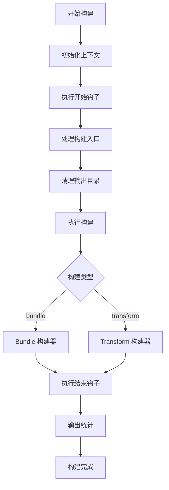
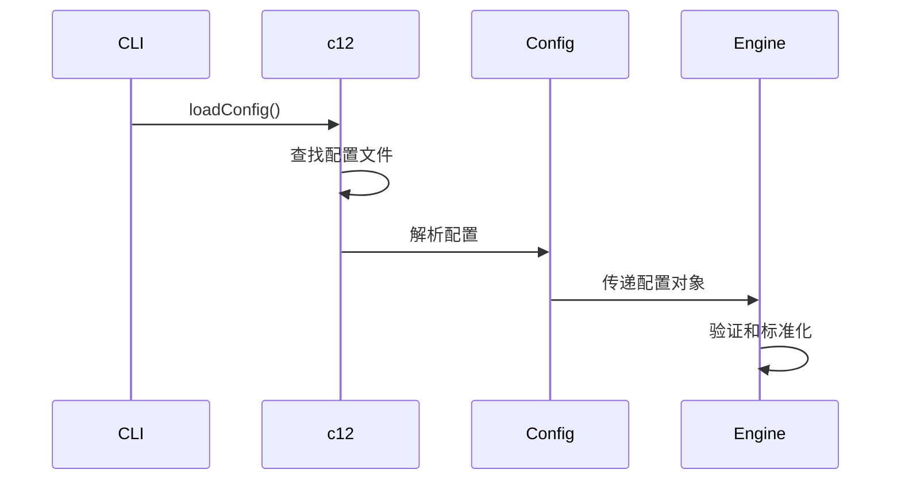
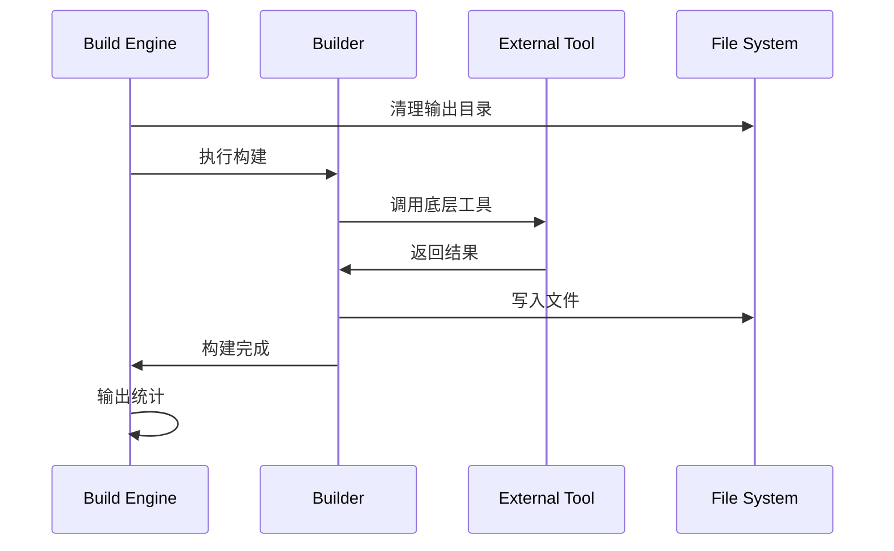
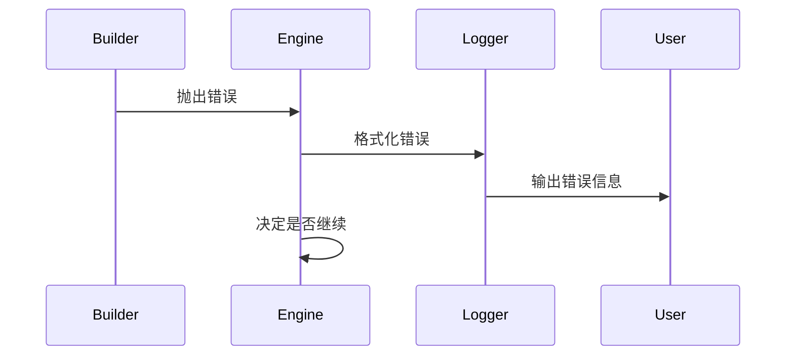

# 核心架构

robuild 的核心架构由几个关键组件组成，每个组件都有明确的职责和清晰的接口。

## 源码结构

```
src/
├── index.ts          # 主入口，导出公共 API
├── cli.ts            # CLI 入口，处理命令行参数
├── build.ts          # 构建引擎，协调整个构建流程
├── config.ts         # 配置定义和验证
├── types.ts          # TypeScript 类型定义
├── utils.ts          # 工具函数
└── builders/         # 构建器实现
    ├── bundle.ts     # Bundle 构建器
    ├── transform.ts  # Transform 构建器
    └── plugins/      # 插件实现
        └── shebang.ts # Shebang 处理插件
```

## 核心组件分析

### 1. 主入口 (index.ts)

```typescript
// src/index.ts
export { build } from './build'
export { defineBuildConfig } from './config'
export type {
  BuildConfig,
  BuildEntry,
  BundleEntry,
  TransformEntry,
} from './types'
```

**职责：**
- 导出公共 API
- 提供类型定义
- 隐藏内部实现细节

### 2. CLI 入口 (cli.ts)

```typescript
// src/cli.ts
#!/usr/bin/env node

import { parseArgs } from 'node:util'
import { loadConfig } from 'c12'
import { build } from './build'

const args = parseArgs({
  args: process.argv.slice(2),
  allowPositionals: true,
  options: {
    dir: { type: 'string', default: '.' },
    stub: { type: 'boolean', default: false },
  },
})

const { config = {} } = await loadConfig<BuildConfig>({
  name: 'robuild',
  configFile: 'build.config',
  cwd: args.values.dir,
})

// 处理构建入口
const rawEntries = args.positionals.length > 0
  ? args.positionals as string[]
  : config.entries || []

// 执行构建
await build({
  cwd: args.values.dir,
  ...config,
  entries,
})
```

**职责：**
- 解析命令行参数
- 加载配置文件
- 标准化构建入口
- 调用构建引擎

### 3. 构建引擎 (build.ts)

构建引擎是 robuild 的核心，负责协调整个构建流程：

```typescript
// src/build.ts
export async function build(config: BuildConfig): Promise<void> {
  const start = Date.now()

  // 1. 初始化构建上下文
  const pkgDir = normalizePath(config.cwd)
  const pkg = await readJSON(join(pkgDir, 'package.json')).catch(() => ({}))
  const ctx: BuildContext = { pkg, pkgDir }

  // 2. 执行开始钩子
  const hooks = config.hooks || {}
  await hooks.start?.(ctx)

  // 3. 处理构建入口
  const entries = normalizeEntries(config.entries || [], pkgDir)
  await hooks.entries?.(entries, ctx)

  // 4. 清理输出目录
  await cleanupOutputDirs(entries)

  // 5. 执行构建
  for (const entry of entries) {
    await (entry.type === 'bundle'
      ? rolldownBuild(ctx, entry, hooks)
      : transformDir(ctx, entry))
  }

  // 6. 执行结束钩子
  await hooks.end?.(ctx)

  // 7. 输出统计信息
  outputBuildStats(outDirs, start)
}
```

**核心流程：**



### 4. 类型系统 (types.ts)

robuild 使用 TypeScript 提供完整的类型安全：

```typescript
// src/types.ts
export interface BuildContext {
  pkgDir: string
  pkg: { name: string } & Record<string, unknown>
}

export interface BuildEntry {
  outDir?: string
  stub?: boolean
}

export type BundleEntry = BuildEntry & {
  type: 'bundle'
  input: string | string[]
  minify?: boolean | 'dce-only' | MinifyOptions
  rolldown?: InputOptions & { plugins?: RolldownPluginOption[] }
  dts?: boolean | DtsOptions
}

export type TransformEntry = BuildEntry & {
  type: 'transform'
  input: string
  minify?: boolean | OXCMinifyOptions
  oxc?: TransformOptions
  resolve?: Omit<ResolveOptions, 'from'>
}

export interface BuildHooks {
  start?: (ctx: BuildContext) => void | Promise<void>
  end?: (ctx: BuildContext) => void | Promise<void>
  entries?: (entries: BuildEntry[], ctx: BuildContext) => void | Promise<void>
  rolldownConfig?: (cfg: InputOptions, ctx: BuildContext) => void | Promise<void>
  rolldownOutput?: (cfg: OutputOptions, res: RolldownBuild, ctx: BuildContext) => void | Promise<void>
}
```

**类型设计原则：**
- 严格的类型定义
- 清晰的接口边界
- 良好的扩展性
- 完整的类型推导

### 5. 工具函数 (utils.ts)

提供通用的工具函数：

```typescript
// src/utils.ts
export function fmtPath(path: string): string {
  return relative(process.cwd(), path)
}

export async function analyzeDir(dirs: string[]): Promise<{ size: number; files: number }> {
  // 分析目录大小和文件数量
}

export async function distSize(outDir: string, fileName: string): Promise<{
  size: number
  minSize: number
  minGzipSize: number
}> {
  // 计算文件大小
}

export async function sideEffectSize(outDir: string, fileName: string): Promise<number> {
  // 计算副作用大小
}
```

## 数据流分析

### 1. 配置加载流程



### 2. 构建执行流程



### 3. 错误处理流程



## 关键设计模式

### 1. 策略模式 (Strategy Pattern)

构建器使用策略模式处理不同的构建类型：

```typescript
// 构建策略
const buildStrategies = {
  bundle: rolldownBuild,
  transform: transformDir,
}

// 执行构建
await buildStrategies[entry.type](ctx, entry, hooks)
```

### 2. 钩子模式 (Hook Pattern)

使用钩子模式实现可扩展的构建流程：

```typescript
// 钩子执行
await hooks.start?.(ctx)
await hooks.entries?.(entries, ctx)
await hooks.end?.(ctx)
```

### 3. 工厂模式 (Factory Pattern)

构建入口使用工厂模式创建不同类型的构建配置：

```typescript
// 入口工厂
function createBuildEntry(rawEntry: string | BuildEntry): BuildEntry {
  if (typeof rawEntry === 'string') {
    return parseStringEntry(rawEntry)
  }
  return rawEntry
}
```

### 4. 适配器模式 (Adapter Pattern)

适配不同的底层工具：

```typescript
// oxc 适配器
const oxcAdapter = {
  transform: (code: string, options: TransformOptions) => {
    return oxcTransform.transform(code, options)
  }
}

// rolldown 适配器
const rolldownAdapter = {
  build: (config: InputOptions) => {
    return rolldown(config)
  }
}
```

## 性能优化策略

### 1. 异步处理

```typescript
// 并行处理多个构建入口
const promises = entries.map(entry =>
  buildStrategies[entry.type](ctx, entry, hooks)
)
await Promise.all(promises)
```

### 2. 智能缓存

```typescript
// 缓存依赖解析结果
const depsCache = new Map<string, Set<string>>()

function resolveDeps(chunk: OutputChunk): string[] {
  if (depsCache.has(chunk)) {
    return [...depsCache.get(chunk)!]
  }
  // 解析依赖并缓存
}
```

### 3. 流式处理

```typescript
// 流式处理大文件
async function processLargeFile(filePath: string) {
  const stream = createReadStream(filePath)
  // 流式处理，避免内存溢出
}
```

## 扩展性设计

### 1. 插件系统

```typescript
// 插件接口
interface Plugin {
  name: string
  setup?: (ctx: PluginContext) => void
  transform?: (code: string, id: string) => string
}

// 插件注册
const plugins: Plugin[] = []
plugins.push(shebangPlugin())
```

### 2. 自定义构建器

```typescript
// 构建器注册
const builders = new Map<string, Builder>()

builders.set('custom', {
  build: async (ctx, entry) => {
    // 自定义构建逻辑
  }
})
```

### 3. 配置扩展

```typescript
// 配置扩展
interface ExtendedConfig extends BuildConfig {
  customOption?: string
  customPlugin?: Plugin
}
```

## 下一步

- [构建器](./builders.md) - Bundle 和 Transform 构建器详解
- [插件系统](./plugins.md) - 插件架构和开发指南
- [性能分析](./performance.md) - 性能优化和基准测试
