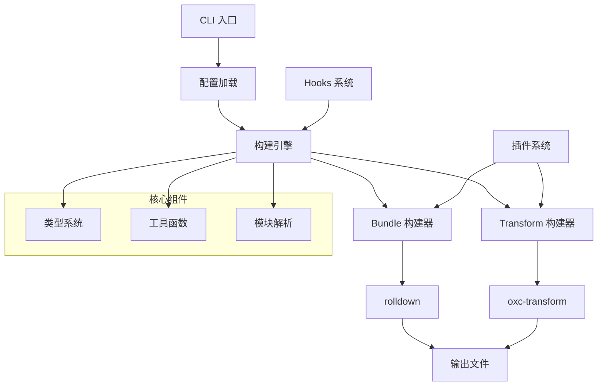
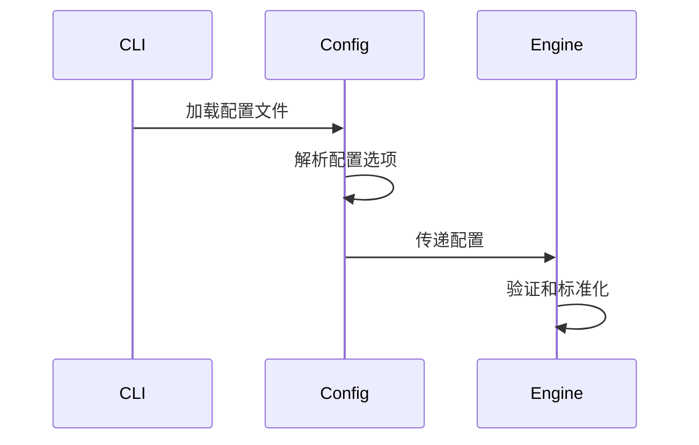
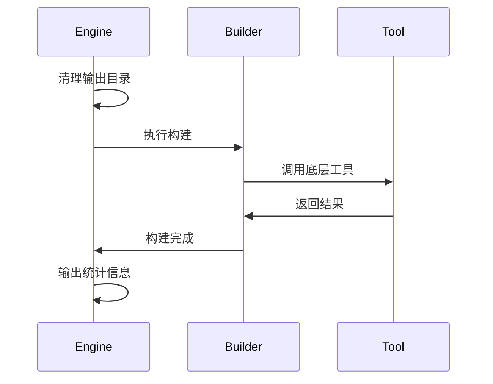
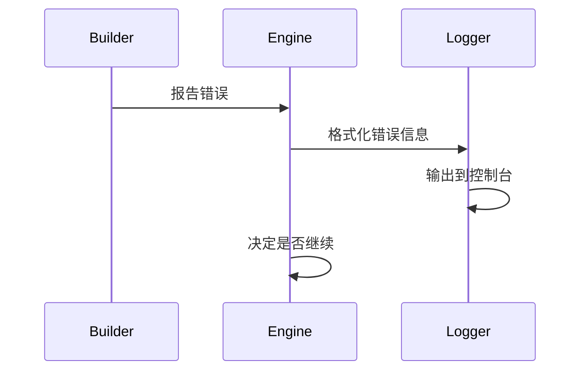

# 架构概述

robuild 采用模块化、插件化的架构设计，专注于提供高性能、易扩展的构建体验。

## 整体架构



## 核心设计原则

### 1. 模块化设计
- 每个功能模块独立，职责单一
- 通过清晰的接口进行通信
- 便于测试和维护

### 2. 插件化架构
- 核心功能稳定，扩展功能插件化
- 支持自定义构建流程
- 易于集成第三方工具

### 3. 性能优先
- 基于 Rust 编写的 oxc 解析器
- 高性能的 rolldown 打包器
- 智能缓存和增量构建

### 4. 零配置优先
- 智能默认配置
- 自动检测项目结构
- 最小化配置复杂度

## 架构层次

### 1. 应用层 (Application Layer)
- **CLI 接口**: 命令行工具入口
- **配置管理**: 配置文件加载和解析
- **用户交互**: 控制台输出和错误处理

### 2. 核心层 (Core Layer)
- **构建引擎**: 协调整个构建流程
- **类型系统**: TypeScript 类型定义
- **工具函数**: 通用工具和辅助函数

### 3. 构建层 (Build Layer)
- **Bundle 构建器**: 基于 rolldown 的打包功能
- **Transform 构建器**: 基于 oxc 的转换功能
- **插件系统**: 扩展构建功能

### 4. 底层 (Infrastructure Layer)
- **模块解析**: 依赖解析和路径处理
- **文件系统**: 文件读写和目录操作
- **外部工具**: oxc、rolldown 等底层工具

## 核心组件

### 1. 构建引擎 (Build Engine)
构建引擎是 robuild 的核心，负责协调整个构建流程：

```typescript
// 主要职责
- 解析配置和入口
- 协调构建器执行
- 管理构建生命周期
- 处理错误和日志
```

### 2. Bundle 构建器
基于 rolldown 的打包构建器：

```typescript
// 主要功能
- 多入口打包
- 代码分割
- 依赖外部化
- 类型声明生成
```

### 3. Transform 构建器
基于 oxc 的转换构建器：

```typescript
// 主要功能
- TypeScript 转换
- 模块解析重写
- 文件结构保持
- 声明文件生成
```

### 4. 插件系统
可扩展的插件架构：

```typescript
// 插件类型
- rolldown 插件
- 构建钩子
- 自定义转换器
```

## 数据流

### 1. 配置加载


### 2. 构建执行


### 3. 错误处理


## 扩展点

### 1. 构建钩子
```typescript
interface BuildHooks {
  start?: (ctx: BuildContext) => void | Promise<void>
  end?: (ctx: BuildContext) => void | Promise<void>
  entries?: (entries: BuildEntry[], ctx: BuildContext) => void | Promise<void>
  rolldownConfig?: (config: InputOptions, ctx: BuildContext) => void | Promise<void>
  rolldownOutput?: (output: OutputOptions, res: RolldownBuild, ctx: BuildContext) => void | Promise<void>
}
```

### 2. 插件接口
```typescript
interface Plugin {
  name: string
  setup?: (ctx: PluginContext) => void | Promise<void>
  transform?: (code: string, id: string) => string | Promise<string>
}
```

### 3. 自定义构建器
```typescript
interface CustomBuilder {
  type: string
  build: (ctx: BuildContext, entry: BuildEntry) => Promise<void>
}
```

## 性能优化

### 1. 并行处理
- 多入口并行构建
- 文件转换并行执行
- 异步 I/O 操作

### 2. 智能缓存
- 构建结果缓存
- 依赖解析缓存
- 增量构建支持

### 3. 内存管理
- 流式处理大文件
- 及时释放内存
- 避免内存泄漏

## 技术选型

### 1. 核心依赖
- **oxc**: 极速的 JavaScript/TypeScript 解析和转换
- **rolldown**: 高性能的 JavaScript 打包器
- **exsolve**: 智能的模块解析
- **magic-string**: 高效的源码操作

### 2. 工具链
- **TypeScript**: 类型安全和开发体验
- **consola**: 美观的控制台输出
- **c12**: 配置文件加载
- **defu**: 深度合并工具

### 3. 开发工具
- **vitest**: 单元测试
- **eslint**: 代码质量
- **prettier**: 代码格式化

## 下一步

- [核心架构](./core.md) - 深入了解核心组件
- [构建器](./builders.md) - Bundle 和 Transform 构建器详解
- [插件系统](./plugins.md) - 插件架构和开发指南
- [性能分析](./performance.md) - 性能优化和基准测试
