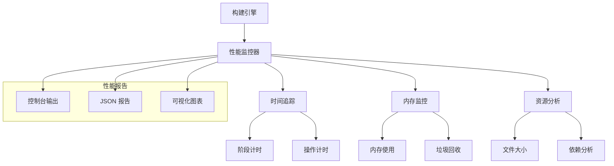

# 性能分析

robuild 的性能分析系统帮助你了解构建性能，识别瓶颈，并优化构建过程。

## 性能监控架构

### 整体设计



## 性能监控器

### 核心实现

```typescript
// src/performance/monitor.ts
export class PerformanceMonitor {
  private timers: Map<string, Timer> = new Map()
  private memorySnapshots: MemorySnapshot[] = []
  private metrics: BuildMetrics = {
    totalTime: 0,
    phases: {},
    memory: {
      peak: 0,
      average: 0,
      gc: 0
    },
    files: {
      processed: 0,
      totalSize: 0,
      averageSize: 0
    }
  }

  constructor(private options: MonitorOptions = {}) {
    this.startTime = Date.now()
  }

  // 开始计时
  startTimer(name: string): void {
    this.timers.set(name, {
      start: Date.now(),
      end: 0,
      duration: 0
    })
  }

  // 结束计时
  endTimer(name: string): number {
    const timer = this.timers.get(name)
    if (!timer) {
      throw new Error(`计时器不存在: ${name}`)
    }

    timer.end = Date.now()
    timer.duration = timer.end - timer.start

    this.metrics.phases[name] = timer.duration
    return timer.duration
  }

  // 记录内存快照
  takeMemorySnapshot(): void {
    const usage = process.memoryUsage()
    this.memorySnapshots.push({
      timestamp: Date.now(),
      rss: usage.rss,
      heapUsed: usage.heapUsed,
      heapTotal: usage.heapTotal,
      external: usage.external
    })

    // 更新峰值内存
    this.metrics.memory.peak = Math.max(
      this.metrics.memory.peak,
      usage.heapUsed
    )
  }

  // 生成报告
  generateReport(): PerformanceReport {
    this.calculateMetrics()

    return {
      summary: this.generateSummary(),
      details: this.generateDetails(),
      recommendations: this.generateRecommendations()
    }
  }
}
```

### 计时器系统

```typescript
interface Timer {
  start: number
  end: number
  duration: number
}

interface BuildMetrics {
  totalTime: number
  phases: Record<string, number>
  memory: {
    peak: number
    average: number
    gc: number
  }
  files: {
    processed: number
    totalSize: number
    averageSize: number
  }
}
```

## 性能追踪

### 1. 构建阶段追踪

```typescript
// src/performance/tracker.ts
export class BuildTracker {
  constructor(private monitor: PerformanceMonitor) {}

  // 追踪配置加载
  async trackConfigLoad<T>(fn: () => Promise<T>): Promise<T> {
    this.monitor.startTimer('config-load')
    try {
      const result = await fn()
      return result
    } finally {
      this.monitor.endTimer('config-load')
    }
  }

  // 追踪文件扫描
  async trackFileScan<T>(fn: () => Promise<T>): Promise<T> {
    this.monitor.startTimer('file-scan')
    try {
      const result = await fn()
      return result
    } finally {
      this.monitor.endTimer('file-scan')
    }
  }

  // 追踪构建过程
  async trackBuild<T>(entry: BuildEntry, fn: () => Promise<T>): Promise<T> {
    const phaseName = `build-${entry.type}-${basename(entry.input)}`
    this.monitor.startTimer(phaseName)

    try {
      const result = await fn()
      return result
    } finally {
      this.monitor.endTimer(phaseName)
    }
  }

  // 追踪后处理
  async trackPostProcess<T>(fn: () => Promise<T>): Promise<T> {
    this.monitor.startTimer('post-process')
    try {
      const result = await fn()
      return result
    } finally {
      this.monitor.endTimer('post-process')
    }
  }
}
```

### 2. 内存监控

```typescript
// src/performance/memory.ts
export class MemoryMonitor {
  private snapshots: MemorySnapshot[] = []
  private gcCount = 0

  constructor(private monitor: PerformanceMonitor) {
    this.setupGCMonitoring()
  }

  // 设置 GC 监控
  private setupGCMonitoring(): void {
    if (typeof gc === 'function') {
      const originalGC = gc
      gc = () => {
        this.gcCount++
        originalGC()
      }
    }
  }

  // 定期快照
  startPeriodicSnapshots(interval: number = 1000): void {
    setInterval(() => {
      this.takeSnapshot()
    }, interval)
  }

  // 获取内存快照
  private takeSnapshot(): void {
    const usage = process.memoryUsage()
    this.snapshots.push({
      timestamp: Date.now(),
      rss: usage.rss,
      heapUsed: usage.heapUsed,
      heapTotal: usage.heapTotal,
      external: usage.external
    })
  }

  // 分析内存使用
  analyzeMemoryUsage(): MemoryAnalysis {
    if (this.snapshots.length === 0) {
      return { average: 0, peak: 0, trend: 'stable' }
    }

    const heapUsed = this.snapshots.map(s => s.heapUsed)
    const average = heapUsed.reduce((a, b) => a + b, 0) / heapUsed.length
    const peak = Math.max(...heapUsed)

    // 分析趋势
    const trend = this.analyzeTrend(heapUsed)

    return { average, peak, trend }
  }

  // 分析内存趋势
  private analyzeTrend(values: number[]): 'increasing' | 'decreasing' | 'stable' {
    if (values.length < 2) return 'stable'

    const firstHalf = values.slice(0, Math.floor(values.length / 2))
    const secondHalf = values.slice(Math.floor(values.length / 2))

    const firstAvg = firstHalf.reduce((a, b) => a + b, 0) / firstHalf.length
    const secondAvg = secondHalf.reduce((a, b) => a + b, 0) / secondHalf.length

    const diff = secondAvg - firstAvg
    const threshold = firstAvg * 0.1 // 10% 阈值

    if (diff > threshold) return 'increasing'
    if (diff < -threshold) return 'decreasing'
    return 'stable'
  }
}
```

### 3. 文件分析

```typescript
// src/performance/file-analyzer.ts
export class FileAnalyzer {
  private fileStats: Map<string, FileStats> = new Map()

  // 分析文件
  analyzeFile(filePath: string, content: string): FileStats {
    const stats = {
      path: filePath,
      size: content.length,
      lines: content.split('\n').length,
      imports: this.countImports(content),
      exports: this.countExports(content),
      complexity: this.calculateComplexity(content)
    }

    this.fileStats.set(filePath, stats)
    return stats
  }

  // 统计导入
  private countImports(content: string): number {
    const importRegex = /^import\s+/gm
    return (content.match(importRegex) || []).length
  }

  // 统计导出
  private countExports(content: string): number {
    const exportRegex = /^export\s+/gm
    return (content.match(exportRegex) || []).length
  }

  // 计算复杂度
  private calculateComplexity(content: string): number {
    let complexity = 0

    // 循环复杂度
    const loops = content.match(/\b(for|while|do)\b/g) || []
    complexity += loops.length

    // 条件复杂度
    const conditions = content.match(/\b(if|else|switch|case)\b/g) || []
    complexity += conditions.length

    // 函数复杂度
    const functions = content.match(/\b(function|=>)\b/g) || []
    complexity += functions.length

    return complexity
  }

  // 生成文件报告
  generateFileReport(): FileReport {
    const files = Array.from(this.fileStats.values())

    return {
      totalFiles: files.length,
      totalSize: files.reduce((sum, f) => sum + f.size, 0),
      averageSize: files.reduce((sum, f) => sum + f.size, 0) / files.length,
      largestFile: files.reduce((max, f) => f.size > max.size ? f : max),
      mostComplexFile: files.reduce((max, f) => f.complexity > max.complexity ? f : max),
      fileTypes: this.analyzeFileTypes(files)
    }
  }

  // 分析文件类型
  private analyzeFileTypes(files: FileStats[]): Record<string, number> {
    const types: Record<string, number> = {}

    for (const file of files) {
      const ext = extname(file.path)
      types[ext] = (types[ext] || 0) + 1
    }

    return types
  }
}
```

## 性能报告

### 1. 报告生成器

```typescript
// src/performance/reporter.ts
export class PerformanceReporter {
  constructor(private monitor: PerformanceMonitor) {}

  // 生成控制台报告
  generateConsoleReport(): void {
    const report = this.monitor.generateReport()

    console.log('\n📊 构建性能报告')
    console.log('=' * 50)

    // 总体统计
    console.log(`总构建时间: ${report.summary.totalTime}ms`)
    console.log(`峰值内存: ${this.formatBytes(report.summary.peakMemory)}`)
    console.log(`处理文件: ${report.summary.filesProcessed}`)

    // 阶段分析
    console.log('\n阶段分析:')
    for (const [phase, duration] of Object.entries(report.details.phases)) {
      const percentage = ((duration / report.summary.totalTime) * 100).toFixed(1)
      console.log(`  ${phase}: ${duration}ms (${percentage}%)`)
    }

    // 性能建议
    if (report.recommendations.length > 0) {
      console.log('\n性能建议:')
      report.recommendations.forEach((rec, index) => {
        console.log(`  ${index + 1}. ${rec}`)
      })
    }
  }

  // 生成 JSON 报告
  generateJsonReport(): string {
    const report = this.monitor.generateReport()
    return JSON.stringify(report, null, 2)
  }

  // 生成 HTML 报告
  generateHtmlReport(): string {
    const report = this.monitor.generateReport()
    return this.renderHtmlTemplate(report)
  }

  // 格式化字节
  private formatBytes(bytes: number): string {
    const units = ['B', 'KB', 'MB', 'GB']
    let size = bytes
    let unitIndex = 0

    while (size >= 1024 && unitIndex < units.length - 1) {
      size /= 1024
      unitIndex++
    }

    return `${size.toFixed(2)} ${units[unitIndex]}`
  }
}
```

### 2. 报告模板

```typescript
interface PerformanceReport {
  summary: {
    totalTime: number
    peakMemory: number
    filesProcessed: number
  }
  details: {
    phases: Record<string, number>
    memory: MemoryAnalysis
    files: FileReport
  }
  recommendations: string[]
}
```

## 性能优化建议

### 1. 自动建议生成

```typescript
// src/performance/advisor.ts
export class PerformanceAdvisor {
  // 生成优化建议
  generateRecommendations(metrics: BuildMetrics): string[] {
    const recommendations: string[] = []

    // 分析构建时间
    this.analyzeBuildTime(metrics, recommendations)

    // 分析内存使用
    this.analyzeMemoryUsage(metrics, recommendations)

    // 分析文件处理
    this.analyzeFileProcessing(metrics, recommendations)

    return recommendations
  }

  // 分析构建时间
  private analyzeBuildTime(metrics: BuildMetrics, recommendations: string[]): void {
    const slowPhases = Object.entries(metrics.phases)
      .filter(([_, duration]) => duration > 1000)
      .sort(([_, a], [__, b]) => b - a)

    if (slowPhases.length > 0) {
      const [phase, duration] = slowPhases[0]
      recommendations.push(
        `${phase} 阶段耗时 ${duration}ms，考虑优化该阶段的处理逻辑`
      )
    }

    if (metrics.totalTime > 10000) {
      recommendations.push('总构建时间较长，考虑启用缓存或并行处理')
    }
  }

  // 分析内存使用
  private analyzeMemoryUsage(metrics: BuildMetrics, recommendations: string[]): void {
    const peakMB = metrics.memory.peak / 1024 / 1024

    if (peakMB > 500) {
      recommendations.push('内存使用峰值较高，考虑优化内存密集型操作')
    }

    if (metrics.memory.gc > 10) {
      recommendations.push('垃圾回收频繁，考虑减少内存分配或优化数据结构')
    }
  }

  // 分析文件处理
  private analyzeFileProcessing(metrics: BuildMetrics, recommendations: string[]): void {
    if (metrics.files.processed > 100) {
      recommendations.push('处理文件较多，考虑使用增量构建或文件过滤')
    }

    const avgSizeKB = metrics.files.averageSize / 1024
    if (avgSizeKB > 100) {
      recommendations.push('文件平均大小较大，考虑代码分割或懒加载')
    }
  }
}
```

## 性能基准测试

### 1. 基准测试框架

```typescript
// src/performance/benchmark.ts
export class BenchmarkRunner {
  private results: BenchmarkResult[] = []

  // 运行基准测试
  async runBenchmark(
    name: string,
    fn: () => Promise<any>,
    iterations: number = 5
  ): Promise<BenchmarkResult> {
    const times: number[] = []
    const memorySnapshots: MemorySnapshot[] = []

    console.log(`运行基准测试: ${name}`)

    for (let i = 0; i < iterations; i++) {
      // 清理内存
      if (typeof gc === 'function') {
        gc()
      }

      // 记录开始状态
      const startMemory = process.memoryUsage()
      const startTime = Date.now()

      // 执行测试
      await fn()

      // 记录结束状态
      const endTime = Date.now()
      const endMemory = process.memoryUsage()

      times.push(endTime - startTime)
      memorySnapshots.push({
        timestamp: endTime,
        rss: endMemory.rss - startMemory.rss,
        heapUsed: endMemory.heapUsed - startMemory.heapUsed,
        heapTotal: endMemory.heapTotal - startMemory.heapTotal,
        external: endMemory.external - startMemory.external
      })
    }

    const result: BenchmarkResult = {
      name,
      iterations,
      times,
      memorySnapshots,
      averageTime: times.reduce((a, b) => a + b, 0) / times.length,
      minTime: Math.min(...times),
      maxTime: Math.max(...times),
      averageMemory: memorySnapshots.reduce((sum, s) => sum + s.heapUsed, 0) / memorySnapshots.length
    }

    this.results.push(result)
    return result
  }

  // 生成基准测试报告
  generateBenchmarkReport(): BenchmarkReport {
    return {
      summary: this.generateSummary(),
      results: this.results,
      comparisons: this.generateComparisons()
    }
  }

  // 生成比较报告
  private generateComparisons(): BenchmarkComparison[] {
    const comparisons: BenchmarkComparison[] = []

    for (let i = 0; i < this.results.length; i++) {
      for (let j = i + 1; j < this.results.length; j++) {
        const a = this.results[i]
        const b = this.results[j]

        const timeDiff = ((b.averageTime - a.averageTime) / a.averageTime) * 100
        const memoryDiff = ((b.averageMemory - a.averageMemory) / a.averageMemory) * 100

        comparisons.push({
          testA: a.name,
          testB: b.name,
          timeDifference: timeDiff,
          memoryDifference: memoryDiff,
          faster: timeDiff > 0 ? a.name : b.name,
          moreEfficient: memoryDiff > 0 ? a.name : b.name
        })
      }
    }

    return comparisons
  }
}
```

### 2. 基准测试示例

```typescript
// 运行基准测试
const benchmark = new BenchmarkRunner()

// 测试不同构建模式
await benchmark.runBenchmark('Bundle Mode', async () => {
  await buildWithBundleMode()
})

await benchmark.runBenchmark('Transform Mode', async () => {
  await buildWithTransformMode()
})

// 生成报告
const report = benchmark.generateBenchmarkReport()
console.log(JSON.stringify(report, null, 2))
```

## 性能监控集成

### 1. 构建引擎集成

```typescript
// src/build.ts
export class BuildEngine {
  private performanceMonitor: PerformanceMonitor
  private tracker: BuildTracker

  constructor(options: BuildOptions) {
    this.performanceMonitor = new PerformanceMonitor(options.performance)
    this.tracker = new BuildTracker(this.performanceMonitor)
  }

  async build(config: BuildConfig): Promise<BuildResult> {
    // 开始性能监控
    this.performanceMonitor.startTimer('total-build')

    try {
      // 追踪各个阶段
      const resolvedConfig = await this.tracker.trackConfigLoad(() =>
        this.resolveConfig(config)
      )

      const results = await this.tracker.trackBuild(resolvedConfig, () =>
        this.executeBuild(resolvedConfig)
      )

      const finalResult = await this.tracker.trackPostProcess(() =>
        this.postProcess(results)
      )

      return finalResult
    } finally {
      // 结束性能监控
      this.performanceMonitor.endTimer('total-build')

      // 生成性能报告
      if (this.options.performance?.report) {
        const reporter = new PerformanceReporter(this.performanceMonitor)
        reporter.generateConsoleReport()
      }
    }
  }
}
```

### 2. 配置选项

```typescript
interface PerformanceOptions {
  enabled?: boolean
  report?: boolean
  detailed?: boolean
  output?: 'console' | 'json' | 'html'
  file?: string
}
```

## 下一步

- [构建器](./builders.md) - Bundle 和 Transform 构建器详解
- [插件系统](./plugins.md) - 插件架构和开发指南
- [核心架构](./core.md) - 深入了解核心组件
- [API 文档](../api/) - 程序化 API 使用
