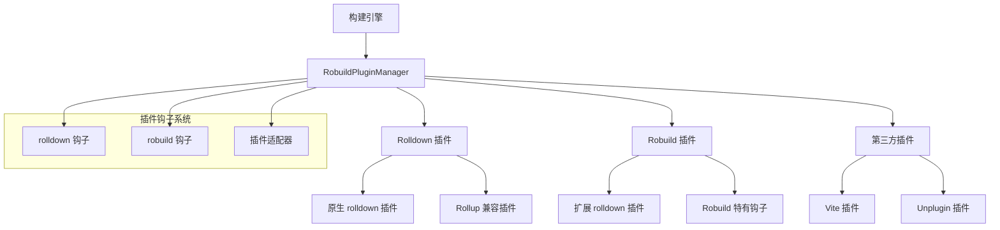

# 插件系统

robuild 的插件系统基于 rolldown 的原生插件架构，提供了强大的扩展能力，允许你自定义构建流程和添加新功能。

## 插件系统架构

### 整体设计



## 插件类型

### 1. RobuildPlugin 接口

robuild 插件继承自 rolldown 的 Plugin 接口，并添加了 robuild 特有的钩子：

```typescript
import type { Plugin as RolldownPlugin } from 'rolldown'

export interface RobuildPlugin extends RolldownPlugin {
  // Robuild 特有钩子（使用 robuild 前缀避免冲突）
  robuildSetup?: (context: RobuildPluginContext) => void | Promise<void>
  robuildBuildStart?: (context: RobuildPluginContext) => void | Promise<void>
  robuildBuildEnd?: (context: RobuildPluginContext, result?: any) => void | Promise<void>

  // 插件元数据，用于兼容性检测
  meta?: {
    framework?: 'rolldown' | 'rollup' | 'vite' | 'unplugin' | 'robuild'
    robuild?: boolean
    rollup?: boolean
    vite?: boolean
    webpack?: boolean
    esbuild?: boolean
    unplugin?: boolean
  }
}
```

### 2. 插件上下文

```typescript
export interface RobuildPluginContext {
  config: RobuildConfig
  entries: BuildEntry[]
  mode: 'bundle' | 'transform'
  target: string
  format: string[]
  platform: 'browser' | 'node' | 'neutral'
}
```

### 3. 插件选项

```typescript
export type RobuildPluginOption =
  | RobuildPlugin
  | RobuildPluginFactory
  | false
  | null
  | undefined

export type RobuildPluginFactory = (...args: any[]) => RobuildPlugin
```

## 插件管理器

### RobuildPluginManager

新的插件管理器基于 rolldown 的插件系统，提供了更好的性能和兼容性：

```typescript
// src/features/plugin-manager.ts
export class RobuildPluginManager {
  private plugins: RobuildPlugin[] = []
  private context: RobuildPluginContext

  constructor(context: RobuildPluginContext) {
    this.context = context
  }

  // 添加插件
  addPlugin(plugin: RobuildPluginOption): void {
    if (!plugin) return

    const resolvedPlugin = typeof plugin === 'function'
      ? plugin()
      : plugin

    this.plugins.push(resolvedPlugin)
  }

  // 添加多个插件
  addPlugins(plugins: RobuildPluginOption[]): void {
    for (const plugin of plugins) {
      this.addPlugin(plugin)
    }
  }

  // 获取 rolldown 兼容的插件列表
  getRolldownPlugins(): RolldownPlugin[] {
    return this.plugins.map(plugin => this.adaptPlugin(plugin))
  }

  // 执行 robuild 特有钩子
  async executeRobuildHooks(hookName: string, ...args: any[]): Promise<void> {
    for (const plugin of this.plugins) {
      const hook = (plugin as any)[hookName]
      if (hook) {
        try {
          await this.callHook(hook, ...args)
        } catch (error) {
          console.warn(`插件 ${plugin.name} 的 ${hookName} 钩子执行失败:`, error)
        }
      }
    }
  }

  // 适配插件到 rolldown 格式
  private adaptPlugin(plugin: RobuildPlugin): RolldownPlugin {
    // 检测插件类型并适配
    const meta = (plugin as any).meta || {}

    if (meta.vite) {
      return this.adaptVitePlugin(plugin)
    } else if (meta.unplugin) {
      return this.adaptUnpluginPlugin(plugin)
    } else {
      // 直接返回，rolldown 兼容 rollup 插件
      return plugin as RolldownPlugin
    }
  }

  // 安全调用插件钩子
  private callHook(hook: any, ...args: any[]): any {
    if (typeof hook === 'function') {
      return hook(...args)
    }
    if (hook && typeof hook.handler === 'function') {
      return hook.handler(...args)
    }
    return null
  }
}
```

### 插件工具函数

```typescript
// src/features/plugin-utils.ts

// 创建 robuild 插件
export function createRobuildPlugin(options: {
  name: string
  setup?: (context: RobuildPluginContext) => void | Promise<void>
  hooks?: Partial<RobuildPlugin>
}): RobuildPlugin {
  const { name, setup, hooks = {} } = options

  return {
    name,
    robuildSetup: setup,
    ...hooks,
    meta: {
      framework: 'robuild',
      robuild: true
    }
  }
}

// 创建转换插件
export function createTransformPlugin(options: {
  name: string
  filter?: RegExp
  transform: (code: string, id: string) => string | Promise<string>
}): RobuildPlugin {
  const { name, filter = /.*/, transform } = options

  return {
    name,
    transform: {
      filter,
      handler: transform
    },
    meta: {
      framework: 'robuild',
      robuild: true
    }
  }
}

// 组合多个插件
export function combinePlugins(...plugins: RobuildPluginOption[]): RobuildPlugin[] {
  return plugins.filter(Boolean) as RobuildPlugin[]
}

// 扩展 rolldown 插件
export function extendRolldownPlugin(
  basePlugin: RolldownPlugin,
  extensions: Partial<RobuildPlugin>
): RobuildPlugin {
  return {
    ...basePlugin,
    ...extensions,
    meta: {
      framework: 'rolldown',
      rolldown: true,
      robuild: true
    }
  }
}
```

## 内置插件

### 1. Shebang 插件

自动处理 shebang 行：

```typescript
// src/plugins/shebang.ts
export interface ShebangOptions {
  shebang?: string
  preserve?: boolean
}

export function shebangPlugin(options: ShebangOptions = {}): BundlePlugin {
  const { shebang = '#!/usr/bin/env node', preserve = true } = options

  return {
    name: 'shebang',
    setup(build) {
      build.onLoad({ filter: /\.(js|mjs)$/ }, async (args) => {
        const code = await readFile(args.path, 'utf-8')

        // 检查是否已有 shebang
        if (code.startsWith('#!')) {
          if (preserve) {
            return { contents: code, loader: 'js' }
          }
          // 移除现有 shebang
          const cleanCode = code.replace(/^#!.*\n/, '')
          return { contents: cleanCode, loader: 'js' }
        }

        // 添加 shebang
        return {
          contents: `${shebang}\n${code}`,
          loader: 'js'
        }
      })
    }
  }
}
```

### 2. JSON 插件

处理 JSON 文件：

```typescript
// src/plugins/json.ts
export function jsonPlugin(): BundlePlugin {
  return {
    name: 'json',
    setup(build) {
      build.onLoad({ filter: /\.json$/ }, async (args) => {
        try {
          const contents = await readFile(args.path, 'utf-8')
          const data = JSON.parse(contents)

          return {
            contents: `export default ${JSON.stringify(data)}`,
            loader: 'js'
          }
        } catch (error) {
          throw new Error(`JSON 解析失败: ${args.path}`)
        }
      })
    }
  }
}
```

### 3. 环境变量插件

替换环境变量：

```typescript
// src/plugins/env.ts
export interface EnvPluginOptions {
  env?: Record<string, string>
  prefix?: string
}

export function envPlugin(options: EnvPluginOptions = {}): BundlePlugin {
  const { env = process.env, prefix = 'process.env.' } = options

  return {
    name: 'env',
    transform(code, id) {
      // 替换 process.env.VARIABLE 为实际值
      return code.replace(
        new RegExp(`${prefix}(\\w+)`, 'g'),
        (match, key) => {
          const value = env[key]
          return value ? JSON.stringify(value) : 'undefined'
        }
      )
    }
  }
}
```

### 4. 文件大小分析插件

分析构建结果：

```typescript
// src/plugins/size-analyzer.ts
export function sizeAnalyzerPlugin(): UniversalPlugin {
  return {
    name: 'size-analyzer',
    afterBuild(result) {
      console.log('\n文件大小分析:')

      for (const file of result.outputFiles) {
        try {
          const stats = statSync(file)
          const sizeKB = (stats.size / 1024).toFixed(2)
          console.log(`  ${file}: ${sizeKB} KB`)
        } catch (error) {
          console.warn(`无法获取文件大小: ${file}`)
        }
      }
    }
  }
}
```

## 自定义插件开发

### 1. 基本插件结构

```typescript
// my-plugin.ts
interface MyPluginOptions {
  enabled?: boolean
  config?: Record<string, any>
}

export function myPlugin(options: MyPluginOptions = {}): BundlePlugin {
  const { enabled = true, config = {} } = options

  if (!enabled) {
    return { name: 'my-plugin' } // 空插件
  }

  return {
    name: 'my-plugin',
    setup(build) {
      console.log('My plugin initialized with config:', config)
    },
    transform(code, id) {
      // 转换逻辑
      if (id.endsWith('.ts') || id.endsWith('.js')) {
        return code.replace(/console\.log/g, '// console.log')
      }
      return code
    }
  }
}
```

### 2. 高级插件示例

```typescript
// auto-import-plugin.ts
interface AutoImportOptions {
  imports: Record<string, string[]>
}

export function autoImportPlugin(options: AutoImportOptions): BundlePlugin {
  const { imports } = options

  return {
    name: 'auto-import',
    transform(code, id) {
      if (!id.endsWith('.ts') && !id.endsWith('.js')) {
        return code
      }

      let importStatements = ''

      // 检查代码中使用的导入
      for (const [module, exports] of Object.entries(imports)) {
        const used = exports.filter(exp =>
          new RegExp(`\\b${exp}\\b`).test(code)
        )

        if (used.length > 0) {
          importStatements += `import { ${used.join(', ')} } from '${module}'\n`
        }
      }

      return importStatements + code
    }
  }
}
```

### 3. 插件配置

```typescript
// 使用自定义插件
import { defineConfig } from 'robuild'
import { myPlugin, autoImportPlugin } from './my-plugins'

export default defineConfig({
  entries: [
    {
      type: 'bundle',
      input: './src/index.ts',
      rolldown: {
        plugins: [
          myPlugin({
            enabled: true,
            config: { debug: true }
          }),
          autoImportPlugin({
            imports: {
              'lodash': ['debounce', 'throttle'],
              'chalk': ['red', 'green', 'blue']
            }
          })
        ]
      }
    }
  ]
})
```

## 插件生态系统

### 1. 官方插件

robuild 提供了一些官方插件：

```typescript
import {
  shebangPlugin,
  // JSON 和环境变量现在由 rolldown 原生支持
  sizeAnalyzerPlugin
} from 'robuild/plugins'
```

### 2. 社区插件

社区维护的插件：

```typescript
import {
  vuePlugin,
  reactPlugin,
  typescriptPlugin
} from '@robuild/plugins'
```

### 3. 插件开发工具

```bash
# 创建插件项目
mkdir robuild-plugin-example
cd robuild-plugin-example
npm init -y

# 安装开发依赖
npm install --save-dev typescript @types/node
npm install robuild
```

## 插件调试

### 1. 调试模式

```typescript
export default defineConfig({
  entries: ['./src/index.ts'],
  rolldown: {
    plugins: [
      {
        name: 'debug-plugin',
        setup(build) {
          // 启用调试日志
          if (process.env.DEBUG) {
            console.log('插件调试信息:', build.config)
          }
        }
      }
    ]
  }
})
```

### 2. 插件测试

```typescript
// 测试插件
import { myPlugin } from './my-plugin'

const plugin = myPlugin({ enabled: true })
const result = plugin.transform('console.log("hello")', 'test.js')
console.log(result) // // console.log("hello")
```

### 3. 错误处理

```typescript
export function safePlugin(): BundlePlugin {
  return {
    name: 'safe-plugin',
    transform(code, id) {
      try {
        // 插件逻辑
        return modifiedCode
      } catch (error) {
        console.error(`插件错误 (${id}):`, error)
        return code // 返回原始代码
      }
    }
  }
}
```

## 性能优化

### 1. 插件缓存

```typescript
export function cachedPlugin(): BundlePlugin {
  const cache = new Map()

  return {
    name: 'cached-plugin',
    transform(code, id) {
      // 使用缓存避免重复处理
      if (cache.has(id)) {
        return cache.get(id)
      }

      const result = processCode(code)
      cache.set(id, result)
      return result
    }
  }
}
```

### 2. 条件执行

```typescript
export function conditionalPlugin(): BundlePlugin {
  return {
    name: 'conditional-plugin',
    transform(code, id) {
      // 只在特定条件下执行
      if (!shouldProcess(id)) {
        return code
      }

      return processCode(code)
    }
  }
}
```

### 3. 并行处理

```typescript
export function parallelPlugin(): BundlePlugin {
  return {
    name: 'parallel-plugin',
    async transform(code, id) {
      // 并行处理多个任务
      const [result1, result2] = await Promise.all([
        processTask1(code),
        processTask2(code)
      ])

      return combineResults(result1, result2)
    }
  }
}
```

## 最佳实践

### 1. 插件命名

```typescript
// ✅ 好的命名
export function robuildPluginVue() { }
export function robuildPluginReact() { }
export function robuildPluginTypescript() { }

// ❌ 避免的命名
export function plugin() { }
export function myPlugin() { }
```

### 2. 错误处理

```typescript
export function robustPlugin(): BundlePlugin {
  return {
    name: 'robust-plugin',
    transform(code, id) {
      try {
        return processCode(code)
      } catch (error) {
        // 记录错误但不中断构建
        console.warn(`插件错误: ${error.message}`)
        return code
      }
    }
  }
}
```

### 3. 类型安全

```typescript
import { type BundlePlugin } from 'robuild/plugins'

export function typedPlugin(): BundlePlugin {
  return {
    name: 'typed-plugin',
    setup(build) {
      // 享受完整的类型提示
      console.log(build.config)
    }
  }
}
```

## 下一步

- [构建器](./builders.md) - Bundle 和 Transform 构建器详解
- [核心架构](./core.md) - 深入了解核心组件
- [性能分析](./performance.md) - 性能优化和基准测试
- [API 文档](../api/) - 程序化 API 使用
